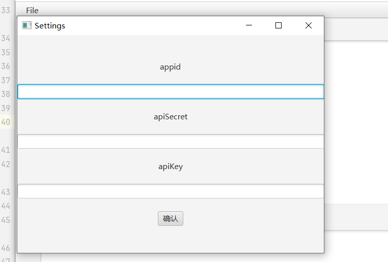
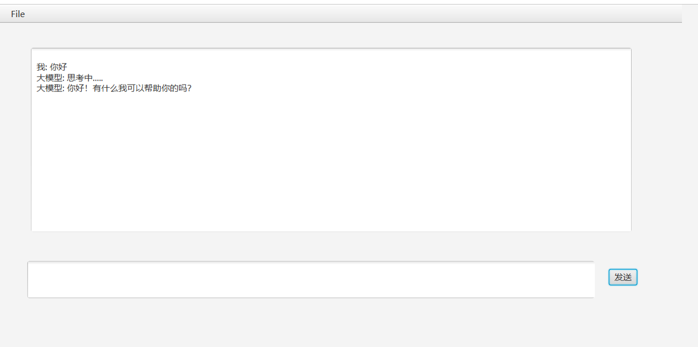

# liaotianAi
用javafx搞一个简单版ai对话（目前支持讯飞）

首先在讯飞里面注册一个应用。

**对了**：[使用javafx，结合讯飞ai，搞了个ai聊天系统_javafx 聊天-CSDN博客](https://blog.csdn.net/m0_63251896/article/details/134121173?ops_request_misc=%7B%22request%5Fid%22%3A%22170652897716800213055667%22%2C%22scm%22%3A%2220140713.130102334.pc%5Fblog.%22%7D&request_id=170652897716800213055667&biz_id=0&utm_medium=distribute.pc_search_result.none-task-blog-2~blog~first_rank_ecpm_v1~rank_v31_ecpm-1-134121173-null-null.nonecase&utm_term=讯飞&spm=1018.2226.3001.4450)

这个是我的博客

其次打开设置输入

然后就可以使用了。

